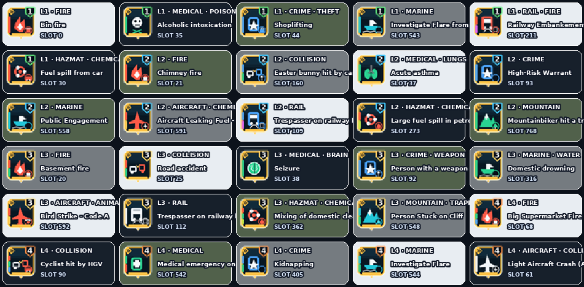

# UK Emergency Response Icons Reborn 2026

[](data/mission-manifest.json)
[](GALLERY.md)
[](docs/STYLE_GUIDE.md)
[](data/qa-report.json)
[](LICENSE.md)

**A complete, compact mission-marker pack for MissionChief UK.** Operational V2
combines a mission-aware incident signature, multi-service colour rail,
permanent **TKB Response Level 1–5**, and accessible red/amber/green map-state
graphics for every current native slot.

[Use the pack on MissionChief](https://www.missionchief.co.uk/mission_graphics/539) ·
[Browse every native mission slot](GALLERY.md) ·
[MissionChief UK guide](https://tkb-gaming.scot/games/missionchief/guides/) ·
[TKB MissionChief scripts](https://tkb-gaming.scot/mission-chief-scripts/)


## Operational V2

Every marker is assembled from a deterministic visual grammar rather than a
single generic service symbol:

- **Mission signature** — incident family, semantic modifier and contextual
  subject combine to distinguish calls such as a coastguard child search, RTC
  entrapment, cardiac arrest and a fire with persons reported.
- **Multi-service rail** — up to three service colours identify the operational
  mix without consuming the main pictogram.
- **Shape-coded state** — alert, movement and completion shapes reinforce red,
  amber and green for colour-blind recognition.
- **Optical level shield** — the 1–5 response level remains readable on dense
  maps without obscuring the incident.
- **Dual map keyline** — the marker survives light, dark, satellite and
  greyscale backgrounds at full and half scale.

## What the number means

| Level | TKB Response Level | Practical meaning |
|---:|---|---|
| 1 | Routine | Planned, welfare, minor or very small response |
| 2 | Standard | Normal single-service emergency or straightforward medical call |
| 3 | Serious | Several units, casualties, specialist capability or multiple services |
| 4 | Major | Large command-led response, complex rescue or significant hazard |
| 5 | Critical | Mass casualty, aircraft, rail, industrial, nuclear or catastrophic incident |

The number is calculated from the mission's current vehicles, personnel,
specialist resources, services, patient potential, clinical acuity, hazards and
bounded credit value. It is a community gameplay aid—not an official UK
emergency-service grade. The complete, auditable scoring breakdown is in
[`data/mission-manifest.json`](data/mission-manifest.json).

## Map state

- **Red alert** — new mission or action still required.
- **Amber movement** — response under way.
- **Green tick** — required resources covered/on scene.

MissionChief switches these three images automatically. The 1–5 badge stays
fixed, so urgency and live progress remain separate signals.



## Complete coverage

- 1,066/1,066 current official UK catalogue records mapped.
- 869/869 current native mission slots plus Hand-off and Custom Alliance covered.
- 2,613 transparent 32×37 PNGs.
- Two pre-provisioned MissionChief rows are marked provisional until their full catalogue metadata is published.
- 19 deterministic incident families, 45 semantic modifiers and 31 contextual subjects.
- 265 current semantic compositions and 455 visually distinct red-state renders.
- All official variants retain their stable MissionChief IDs and map to their
  native base slot; the highest variant level is used so escalation is never understated.
- Light, dark, satellite and greyscale contrast tested at 100% and 50% scale.
- New mission IDs are checked automatically and proposed through a validated PR.

## Rebuild locally

```bash
python -m pip install -r requirements.txt
python scripts/sync_catalogue.py
python scripts/build_icons.py
python scripts/validate_pack.py
python scripts/build_previews.py
python scripts/package_release.py
```

See [the classification model](docs/CLASSIFICATION.md) and
[the icon style guide](docs/STYLE_GUIDE.md) for the versioned design contract.

## Licence

The build and validation code is MIT licensed. Generated artwork is licensed
CC BY-NC-SA 4.0. MissionChief names and game data belong to their respective
owners. See [LICENSE.md](LICENSE.md).
