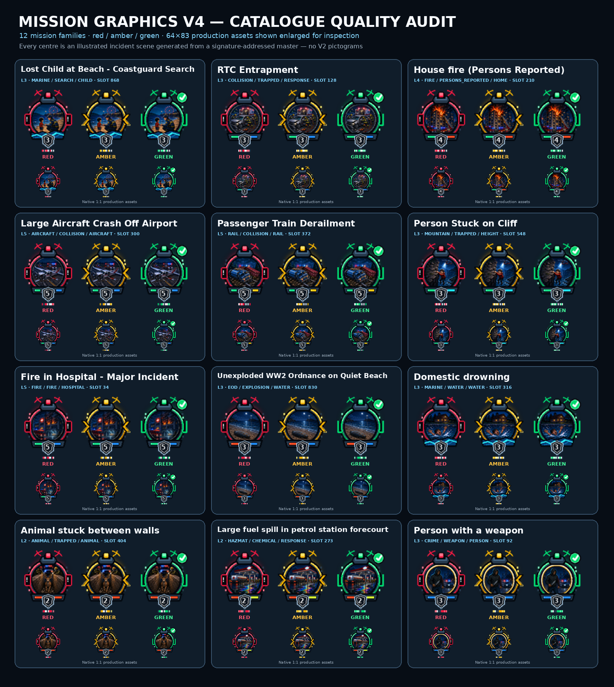

# UK Emergency Response Icons Reborn 2026

[](https://github.com/Conroy1988/UK-Emergency-Response-Icons-Reborn-2026/releases/tag/v4.0.0)
[](data/mission-manifest.json)
[](GALLERY.md)
[](docs/STYLE_GUIDE.md)
[](data/qa-report.json)
[](LICENSE.md)

**A complete premium illustrated mission-marker pack for MissionChief UK.**
Operational V4 gives every native row a detailed incident scene, an independent
TKB Response Level 1–5, the required service mix, and shape-coded red, amber and
green map states.

[Use the pack on MissionChief](https://www.missionchief.co.uk/mission_graphics/539) ·
[Download v4.0.0](https://github.com/Conroy1988/UK-Emergency-Response-Icons-Reborn-2026/releases/tag/v4.0.0) ·
[Browse all mission rows](GALLERY.md) ·
[MissionChief UK guide](https://tkb-gaming.scot/games/missionchief/guides/) ·
[TKB MissionChief scripts](https://tkb-gaming.scot/mission-chief-scripts/)


## Current status

| Area | Status | Exact meaning |
|---|---|---|
| Live MissionChief pack | **Operational V4 synced** | On 2026-08-21 all 871 live rows and all 2,613 red/amber/green images were replaced and audited against this manifest. |
| Repository publication | **Operational V4 published** | [PR #12](https://github.com/Conroy1988/UK-Emergency-Response-Icons-Reborn-2026/pull/12) was squash-merged as commit [`dcd9506`](https://github.com/Conroy1988/UK-Emergency-Response-Icons-Reborn-2026/commit/dcd9506115839e2c72d1f55a4fc6d9e35069f501). |
| Latest public release | **v4.0.0** | The [public release](https://github.com/Conroy1988/UK-Emergency-Response-Icons-Reborn-2026/releases/tag/v4.0.0) contains the versioned ZIP and SHA-256 file; the release workflow completed successfully. |
| Automated V4 QA | **Passing** | Coverage, mappings, scene-master coverage, PNG integrity, colour depth, transparency, state separation, unique output and map visibility pass. |
| V4 upload queue | **Clear · 0 replacements** | The live audit found 871 rows, 2,613 fresh server timestamps, 2,613 expected filenames/state paths and zero mismatches. |

Repository QA, GitHub release publication and the live MissionChief upload are
three separate gates. All three Operational V4 gates are complete.

Normal players do not need to download a ZIP or upload individual files. Open
the [live graphics pack](https://www.missionchief.co.uk/mission_graphics/539)
and use MissionChief's graphics-pack action. Release archives are for offline
inspection, preservation and maintainers.

## What makes V4 different

- **264 curated illustrated scene masters** cover every current semantic
  family/modifier/subject composition instead of substituting generic centre
  pictograms.
- **64 × 83 native RGBA output** preserves the approved scene detail and remains
  practical as a MissionChief map marker.
- **2,613 unique PNG streams** ensure every upload row and operational state is
  deterministic and independently auditable.
- **Shape-coded state choreography** uses red alert pods, amber movement
  chevrons and green coverage brackets/tick, so status does not rely on colour
  alone.
- **Permanent response-level shield** keeps mission scale independent from live
  progress.
- **Real service lightbar** shows the service mix without replacing the incident
  art.
- **Native-row identity code** prevents closely related missions from becoming
  byte-identical while keeping the visible semantic scene consistent.



## How to read a marker

| Signal | Where it appears | Meaning |
|---|---|---|
| Illustrated scene | Centre aperture | The incident, hazard/action and main subject |
| TKB Response Level | Numbered shield `1`–`5` | Estimated gameplay response burden; fixed for that row |
| Service lightbar | Lower illuminated segments | Emergency-service mix required by the mission |
| Map state | Outer colour and side/top choreography | Action required, response moving, or resources covered |
| Row identity | Subdued rim/base marks | Stable technical distinction between related native rows |

A **red Level 1** marker is a small mission that still needs action. A **green
Level 5** marker is a critical-scale mission whose required resources are
covered. Level and state deliberately remain independent.

## TKB Response Levels

| Level | Label | Practical meaning |
|---:|---|---|
| 1 | Routine | Planned, welfare, minor or very small response |
| 2 | Standard | Normal single-service emergency or straightforward medical call |
| 3 | Serious | Several units, casualties, specialist capability or multiple services |
| 4 | Major | Large command-led response, complex rescue or significant hazard |
| 5 | Critical | Mass casualty, aircraft, rail, industrial, nuclear or catastrophic incident |

The level is calculated from current vehicle/personnel requirements, specialist
resources, services, patient potential, clinical acuity, hazards and bounded
credit value. It is a community gameplay aid, not an official UK emergency-
service grade. The auditable score and components are in
[`data/mission-manifest.json`](data/mission-manifest.json).

## MissionChief map states

| State | Shape cue | Exact meaning |
|---|---|---|
| **Red — attention required** | Alert pods, exclamation marks and radio arcs | New mission or action/resources still required |
| **Amber — response moving** | Directional chevrons | Units assigned or travelling; coverage incomplete |
| **Green — resources covered** | Coverage brackets and tick | Declared requirements covered/on scene |

Green does not necessarily mean completed, paid out or removed from the map.
MissionChief switches the three images automatically. See
[Status and signal guide](docs/STATUS_GUIDE.md).

## Complete coverage

- 1,066/1,066 current official UK catalogue records mapped.
- 869/869 numbered native mission slots, plus Hand-off and Custom Alliance.
- 871 upload rows and 2,613 transparent 64 × 83 RGBA PNGs.
- 264 semantic compositions backed by 264 curated scene masters.
- 871 unique row codes and 2,613 unique final PNG byte streams.
- Two visible rows remain conservatively provisioned until their complete
  official catalogue metadata is published.
- Light, dark, satellite and greyscale contrast checked at native and 50% scale.

Official variants retain stable MissionChief IDs and map to their native base
slot. Each row takes the highest response level among its current variants so
escalation is never understated.

## Download and verify v4.0.0

- [Release page and notes](https://github.com/Conroy1988/UK-Emergency-Response-Icons-Reborn-2026/releases/tag/v4.0.0)
- [Download the verified ZIP](https://github.com/Conroy1988/UK-Emergency-Response-Icons-Reborn-2026/releases/download/v4.0.0/UK-Emergency-Response-Icons-Reborn-2026-v4.0.0.zip)
- [Download the SHA-256 file](https://github.com/Conroy1988/UK-Emergency-Response-Icons-Reborn-2026/releases/download/v4.0.0/UK-Emergency-Response-Icons-Reborn-2026-v4.0.0.zip.sha256)

Expected ZIP SHA-256:

```text
e3a2a012a4f100c13a16ed572696867c19483522b77d3c6449b9a8b723e5e741
```

## Rebuild and verify

```bash
python -m pip install -r requirements.txt
python scripts/sync_catalogue.py
python scripts/build_icons.py
python scripts/validate_pack.py
python scripts/build_previews.py
PACK_VERSION=4.0.0 python scripts/package_release.py
```

See [the classification model](docs/CLASSIFICATION.md),
[the icon style guide](docs/STYLE_GUIDE.md), and
[the V4 release notes](docs/RELEASE_v4.0.0.md).

## Licence

Build and validation code is MIT licensed. Generated artwork is licensed
CC BY-NC-SA 4.0. MissionChief names and game data belong to their respective
owners. See [LICENSE.md](LICENSE.md).
