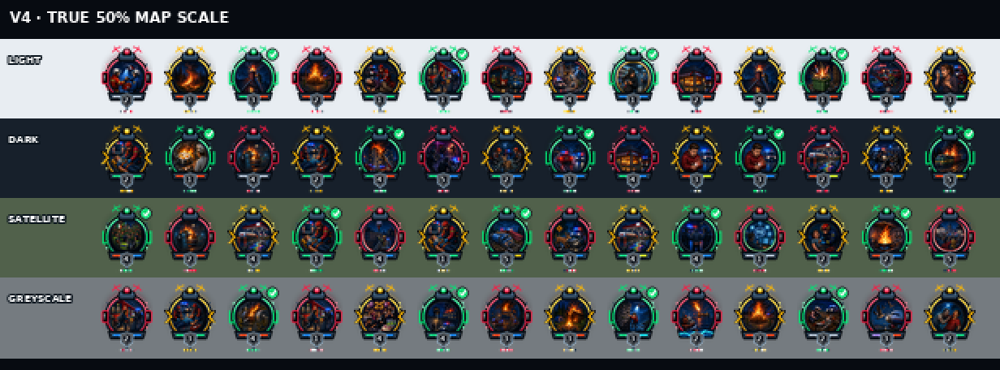

# Operational V4 icon system

Operational V4 is the premium illustrated MissionChief UK marker system. It
replaces the rejected small centre pictograms with curated incident artwork and
keeps mission meaning, response burden, required services and live state as
separate readable signals.

## Fixed delivery contract

- Canvas: 64 × 83 pixels, transparent RGBA.
- Output: one red, amber and green PNG for every upload row.
- Source art: 264 curated 256 × 256 RGBA illustrated scene masters.
- Renderer: deterministic Python/Pillow composition with no copied game assets,
  registrations or external logos.
- Review sizes: native 64 × 83, enlarged audit sheets and simulated 32 × 42
  dense-map scale.

## Visual stack

1. A transparent pointer and multi-layer response shell establish a consistent
   map silhouette.
2. The curated scene master communicates the family, action/hazard and subject.
3. State choreography supplies red alert, amber movement or green coverage
   geometry and colour.
4. The service bar shows the actual emergency-service mix.
5. The permanent shield displays TKB Response Level 1–5.
6. Subdued deterministic marks distinguish closely related native rows.

## Curated incident scenes

The canonical title and classified service data produce a semantic signature:

```text
family:modifier:subject
```

Every one of the 264 current signatures has a corresponding scene master under
`assets/scenes/`. Closely related mission rows intentionally share their
semantic scene; their fixed level, service mix and native-row identity code keep
the final outputs distinct. Missing scene masters are a hard build/QA failure.

The scene library spans fire, collisions, medicine, cardiac calls, policing,
crime, marine, aviation, rail, hazmat, EOD, mountain rescue, collapse, weather,
utilities, animals, crowds and generic response work.

## State choreography

| State | Base colour | Shape cue | Exact meaning |
|---|---|---|---|
| Red | `#ff183f` | Alert pods, exclamation marks and radio arcs | Action/resources required |
| Amber | `#ffb000` | Directional side chevrons | Response moving; coverage incomplete |
| Green | `#00d96f` | Coverage brackets and tick roundel | Required resources covered/on scene |

The centre scene and response level do not change between states. Green does
not mean the mission has completed.

## Service lightbar

The lower illuminated segments use only services attached to the slot:

| Colour | Service |
|---|---|
| Red-orange | Fire |
| Blue | Police |
| Green | Ambulance |
| Cyan | Marine/coastguard |
| White | Mountain rescue |
| Purple | Air |
| Gold | Rail |
| Lime | Hazmat |
| Steel | Mixed/other |

Marine scenes retain the approved wave ribbon in the corresponding area.

## Response shield

The bottom-centre shield permanently displays one numeral:

- Level 1 — Routine
- Level 2 — Standard
- Level 3 — Serious
- Level 4 — Major
- Level 5 — Critical

The number estimates gameplay burden, not live progress or clinical triage.

## Determinism and anti-twin control

`scene_code_for(name, slot_id)` derives a stable six-character code from the
native slot and canonical title. Subordinate rim and base marks encode it. The
V4 build therefore has 871 distinct red-state renders and 2,613 distinct PNG
streams while preserving shared artwork for genuinely related semantics.

## Quality gates

The pack cannot pass validation unless all of these hold:

- every catalogue record maps exactly once;
- all 871 upload rows have red, amber and green files;
- all 264 semantic signatures have a scene master;
- every output is a decodable 64 × 83 RGBA PNG with transparent corners;
- every scene clears minimum colour complexity and visible coverage;
- state signal and shape variants remain distinct;
- all 2,613 PNG byte streams are unique;
- contrast survives light, dark, satellite and greyscale backgrounds at 50%.


